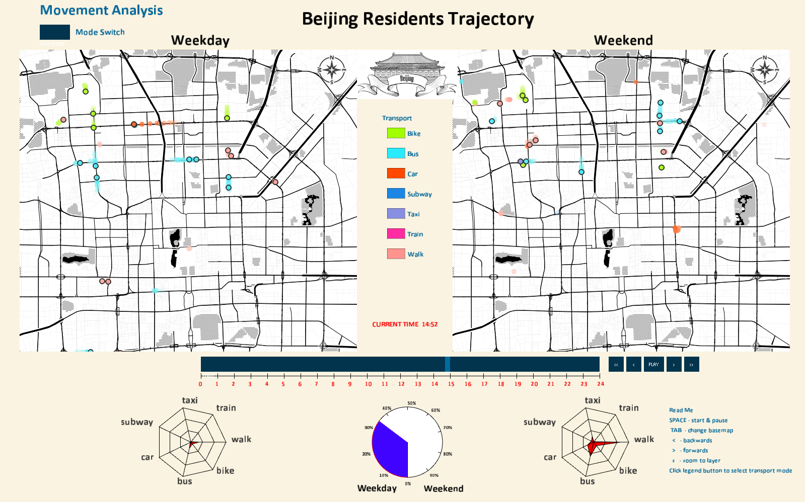

# Spatial-visualisation
Spatial Visualisation Group Project  

##### Program video:  
[Video on Youtube](https://www.youtube.com/embed/c_u1-snYJc0)  
  

Thanks to team members: Haoyu PANG, Cheng LI, Kaiming SUN  

Please unzip the data into data folder for R and Processing, ensuring the folder link is as follow:  
*\data\Geolife Trajectories 1.3\Data\000\Trajectory  

Data: GeoLife GPS Trajectories in Microsof Research Asia  
Processing package: ControlP5, UnfoldingMap(only Processing 2)
